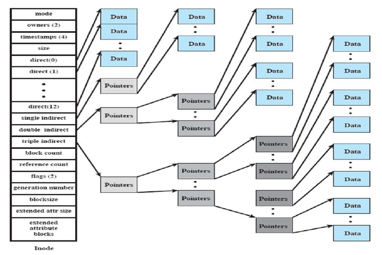
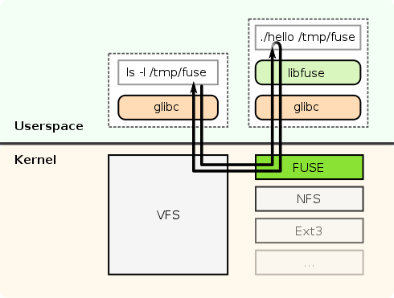

# SISOP MODUL 4

Requirement:
1. Linux
2. FUSE
3. gcc / g++

## Objectives
1. Peserta mengetahui file system
2. Peserta mengetahui FUSE
3. Peserta mampu mengimplementasikan FUSE

## Daftar Isi
- [1. File System](https://github.com/rohanaq/sisop-modul-4#1-file-system)
- [1.1 Tipe File System](https://github.com/rohanaq/sisop-modul-4#11-tipe-file-system)
- [1.2 Virtual File System](https://github.com/rohanaq/sisop-modul-4#12-virtual-file-system)
- [1.3 Dentry](https://github.com/rohanaq/sisop-modul-4#13-dentry)
- [1.4 Superblock](https://github.com/rohanaq/sisop-modul-4#14-superblock)
- [1.5 Inode](https://github.com/rohanaq/sisop-modul-4#15-inode)
- [2. File System in Userspace (FUSE)](https://github.com/rohanaq/sisop-modul-4#2-file-system-in-userspace-fuse)
- [2.1 Instalasi Fuse](https://github.com/rohanaq/sisop-modul-4#21-instalasi-fuse)
- [2.2 Membuat File System dengan Fuse](https://github.com/rohanaq/sisop-modul-4#22-membuat-file-system-dengan-fuse)

# 1. File System
File System adalah struktur logika yang digunakan untuk mengendalikan akses terhadap data yang ada pada harddisk. Terdapat berbagai jenis-jenisnya dan penggunaan algoritma yang berbeda. Semakin baru jenis dari sebuah File System, maka semakin bagus pula kualitas dari File System tersebut.

### 1.1 Tipe File System
**1. File System Disk**

Sebuah file system disk adalah file system yang didesain untuk menyimpan data pada sebuah media penyimpan data. Contohnya: FAT (FAT 12, FAT 16, FAT 320), NTFS, HFS, HFS+, ext2, ext3, ext4, ISO 9660, ODS-5 dan UDF.

**2. File System Flash**

Sebuah file system Flash adalah file system yang didesain untuk menyimpan data pada media flash memory. Hal ini menjadi lazim ketika jumlah perangkat mobile semakin banyak dan kapasitas memory flash yang semakin besar.

**3. File System Database**

Konsep baru untuk manajemen file adalah konsep file system berbasis database. Sebagai perbaikan bagi Manajemen terstruktur hirarkis, file diidentifikasi oleh karakteristiknya, seperti tipe file, topik, pembuat atau metadata yang sama.

**4. File System Transaksional**

Setiap operasi disk dapat melibatkan perubahan ke sejumlah file dan struktur disk yang berbeda. Dalam
banyak kasus, perubahan ini berhubungan. Hali in iberarti bahwa operasi ini dieksekusi pada waktu yang sama.

**5. File System Jaringan**

File System Network adalah file system yang bertindak sebagai klien untuk protokol akses file jarak jauh, memberikan akses ke file pada sebuah server. Contoh dari File system network ini adalah klien protokol NFS, AFS, SMB, dan klien FTP dan WebDAV

**6. File System untuk Tujuan Khusus**

File System untuk tujuan khusus adalah file system yang tidak termasuk disk file system atau file system Jaringan. Termasuk dalam kategori ini adalah sistem di mana file ditata secara dinamis oleh software, ditujukan untuk tujuan tertentu seperti untuk komunikasi antar proses komputer atau space file sementara. Contohnya file system procfs (/proc) yang dipakai oleh beberapa varian Unix.

**7. File System Journaling**

File system yang mencatat perubahan ke dalam jurnal (biasanya berupa log sirkuolar dalam area tertentu) sebelum melakukan perubahan ke file system. Filesystem seperti ini memiliki kemungkinan yang lebih kecil mengalami kerusakan saat terjadi power failure atau system crash.

### 1.2 Virtual File System
**Virtual file system** adalah suatu lapisan perangkat lunak dalam kernel yang menyediakan interface sistem berkas untuk program userspace. Virtual file system berfungsi agar berbagai sistem berkas yang berbeda dapat di akses oleh aplikasi komputer dengan cara yang seragam. VPS menyediakan antarmuka antara system call dengan system yang sesungguhnya.

### 1.3 Dentry
Dentry atau Directory Entry merupakan sebuah struktur data yang memiliki tugas sebagai penerjemah nama berkas ke inode-nya. Contoh informasi yang disimpan dalam dentry adalah name, pointer to inode, pointer to parent dentry, Use Count dan lainnya. Adapula command dalam VFS dentry adalah D_compare , D_delete , D_release.


### 1.4 Superblock
Setiap sistem berkas yang di-mount akan direpresentasikan oleh sebuah VFS Superblock. Superblock digunakan untuk menyimpan informasi mengenai partisi tersebut. Superblock menyimpan informasi sebagai berikut:
- Device: Merupakan suatu device identifier, contohnya /dev/hda1 adalah harddisk pertama yang terdapat pada sistem memiliki device identifier 0×300.
- Inode Pointer: Merupakan suatu pointer yang menunjuk ke inode pertama pada sistem berkas.
- Blocksize: Menunjukkan ukuran suatu block dari sistem berkas, contohnya 1024 bytes.
- Superblock Operation: Merupakan suatu pointer ke sekumpulan superblock routine (fungsi) dari sistem berkas, contohnya read, write, dan sebagainya.
- File System Type: Menunjukkan tipe dari sistem berkas, contohnya EXT2, FAT, NTFS.
- File System Specific: Merupakan suatu pointer ke informasi yang dibutuhkan oleh
sistem berkas.


### 1.5 Inode
Inode adalah abstraksi VFS untuk berkas. Setiap berkas, directory, dan data lainnya pada VFS direpresentasikan oleh satu dan hanya satu VFS inode. VFS inode hanya terdapat di memori kernel dan disimpan di inode chace selama masih dibutuhkan oleh sistem. Informasi yang disimpan oleh VPS Inode diantaranya:
- Device: Menunjukan device identifier dari suatu device yang menyimpan berkas, ataupun directory.
- Inode Number: Merupakan nomor inode yang unik dalam sistem berkas.
- Mode: Menggambarkan apa yang direpresentasikan oleh VFS inode.
- User ID: Merupakan identifier bagi pemilik berkas.
- Time: Menunjukkan kapan pembuatan, modifikasi, dan penulisan suatu berkas.
- Blocksize: Menunjukkan ukuran dari block yang digunakan oleh berkas.
- Inode Operations: Merupakan pointer ke suatu routine yang melakukan berbagai operasi pada inode.
- Count: Menunjukkan berapa kali suatu sistem telah menggunakan suatu inode.
- Lock: Digunakan untuk mengunci VFS inode.
- File System Specific Information: Menunjukkan informasi khusus yang dibutuhkan oleh suatu inode.


# 2. File System in Userspace (FUSE)
FUSE (Filesystem in Userspace) adalah sebuah _interface_ dimana kita dapat membuat _filesystem_ linux sendiri di _userspace_.

lalu apa yang menyenangkan dari membuat _filesystem_ sendiri di userspace? tentu saja menyenangkan dan merupakan suatu keuntungan yang besar, kita dapat menggunakan _library_ apapun yang tersedia untuk membuat sebuah _filesystem_ sendiri tanpa perlu mengganti kode pada kernel dan tanpa perlu mengerti secara mendalam apa yang _filesystem_ sebenarnya lakukan di _kernelspace_. hal ini dapat dilakukan karena adanya modul fuse yang **menjembatani** antara kode _filesystem_ yang berada di _userspace_ dengan _filesystem_ yang berada di _kernelspace_.

salah satu contoh yang menarik dari fuse adalah [GDFS][7bb7b7cc] (Google Drive File System) dimana GDFS ini memungkinkan kita untuk menunggangkan (mount) Google Drive kita ke sistem linux dan menggunakannya seperti file linux biasa.

  [7bb7b7cc]: https://github.com/robin-thomas/GDFS "GDFS"



Untuk mengimplementasikan FUSE ini, kita harus membuat sebuah program yang terhubung dengan *library* ```libfuse```. tujuan dari program yang dibuat ini adalah menspesifikkan bagaimana *filesystem* merespon *read/write/stat* dari sebuah *request*. program ini juga digunakan untuk menunggangkan *(mount)* *filesystem* asli *(kernelspace)* ke *filesystem* yang baru *(userspace)*. jadi disaat *user* berurusan dengan *read/write/stat request* di *filesystem (userspace)*, kernel akan meneruskan *input output request* tersebut ke program FUSE dan program tersebut akan merespon kembali ke *user*.
Untuk lebih jelasnya mari kita coba membuat program FUSE.

##### Instalasi FUSE
Pertama-tama kita harus memstikan bahwa FUSE sudah ter-install di perangkat anda
```
$ sudo apt update
$ sudo apt install libfuse*
```
##### Membuat Program FUSE
Fuse memiliki ```struct``` yang dinamakan ```fuse_operations``` yang didefinisikan seperti dibawah ini:
```
static struct fuse_operations xmp_oper = {
	.getattr	= xmp_getattr,
	.access		= xmp_access,
	.readlink	= xmp_readlink,
	.readdir	= xmp_readdir,
	.mknod		= xmp_mknod,
	.mkdir		= xmp_mkdir,
	.symlink	= xmp_symlink,
	.unlink		= xmp_unlink,
	.rmdir		= xmp_rmdir,
	.rename		= xmp_rename,
	.link		= xmp_link,
	.chmod		= xmp_chmod,
	.chown		= xmp_chown,
	.truncate	= xmp_truncate,
	.utimens	= xmp_utimens,
	.open		= xmp_open,
	.read		= xmp_read,
	.write		= xmp_write,
	.statfs		= xmp_statfs,
	.create         = xmp_create,
	.release	= xmp_release,
	.fsync		= xmp_fsync,
  .setxattr	= xmp_setxattr,
	.getxattr	= xmp_getxattr,
	.listxattr	= xmp_listxattr,
	.removexattr	= xmp_removexattr,
#endif
};
```
Dapat dilihat bahwa semua atribut pada ```struct``` tersebut adalah pointer yang menuju ke fungsi. setiap fungsi tersebut disebut FUSE saat suatu kejadian yang spesifik terjadi di *filesystem*; sebagai contoh saat user menulis di sebuah file, sebuah fungsi yang ditunjuk oleh atribut "write" di ```struct``` akan terpanggil.

jika kita perhatikan atribut pada ```struct``` tersebut maka kita akan menyadari bahwa atribut yang tertulis disitu adalah sebuah fungsi yang biasa digunakan di linux. sebagai contoh saat kita membuat *directory* di FUSE maka fungsi mkdir akan dipanggil begitu juga fungsi-fungsi lainnya.

Untuk mengimplementasikan FUSE kita harus menggunakan ```struct``` ini dan harus mendefinisikan fungsi yang ada didalam ```struct``` lalu mengisi ```struct``` tersebut dengan pointer dari fungsi yang ingin diimplementasikan. kebanyakan fungsi yang tersedia adalah opsional; kita tidak perlu mengimplementasikan semuanya; meskipun ada beberapa adalah sesuatu yang penting dari sebuah filesystem yang fungsional (contoh: ```getattr```). ya, beberapa fungsi memang harus diimplementasikan dalam filesystem. fungsi-fungsi tersebut adalah ```getattr```, ```readdir``` dan ```read```.

Fungsi getattr akan dipanggil saat sistem mencoba untuk mendapatkan atribut dari sebuah file, Fungsi readdir akan dipanggil saat user mencoba untuk menampilkan file dan direktori yang berada pada suatu direktori yang spesifik, sedangkan funsi read seperti yang kita baca dari namanya funsi read akan dipanggil saat sistem mencoba untuk membaca potongan demi potongan data dari suatu file.


### References
https://www.cs.hmc.edu/~geoff/classes/hmc.cs135.201109/homework/fuse/fuse_doc.html
